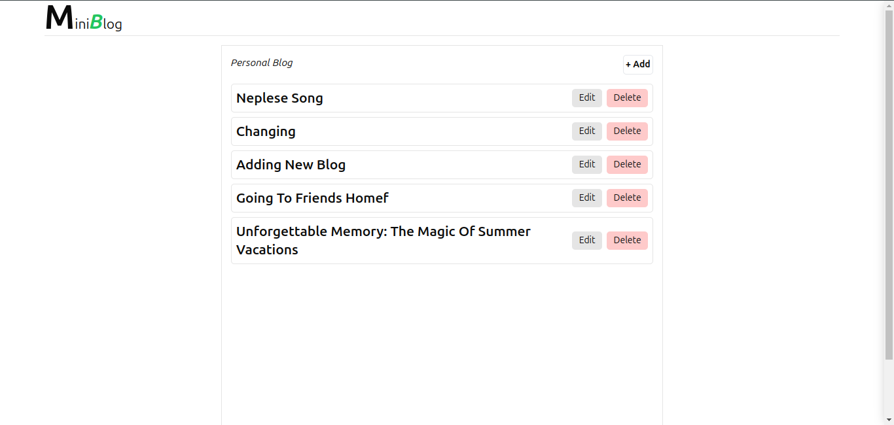

# Personal Blog 
[visit the live application](https://personalblognp.vercel.app/)

## Table of Contents
- [Introduction](#introduction)
- [Features](#features)
- [Technologies Used](#technologies-used)
- [Installation](#installation)
- [Usage](#usage)
- [API Endpoints](#api-endpoints)
- [Contributing](#contributing)
- [License](#license)
- [Contact](#contact)

## Introduction
Personal Blog is a web application that allows users to create, edit, and delete blog posts. It is built using modern web technologies and provides a seamless user experience.

## Features
- Create new blog posts
- Edit existing blog posts
- Delete blog posts
- View a list of all blog posts
- View individual blog post details

## Technologies Used
- **Frontend**: React, Tailwind CSS, Vite
- **Backend**: Node.js, Express, MongoDB
- **Deployment**: Vercel

## Installation
### Prerequisites
- Node.js
- npm or yarn
- MongoDB

### Clone the Repository
```bash
git clone https://github.com/your-username/personal-blog.git
cd personal-blog
```

Install Dependencies

For the frontend:
```
cd frontend
npm install
```

For the backend:
```
cd backend
npm install
```

Environment Variables
- create .env file in the ```backend``` directory and add the following environment variables:

``` 
MONGO_URI=your_mongodb_connection_string
PORT=5000
```

## Usage
<h3>Running the backend</h3>

```
cd backend
npm run server
```

<h3>Running the Frontend</h3>

```
cd frontend
npm run dev
```

### Access the Application  
Open your browser and navigate to:  ```http://localhost:5173```

### API Endpoints

## **Endpoints**

### **1. Get All Blog Posts**
**Endpoint:**  
`GET /api/admin/getBlog`

**Description:**  
Fetch all blog posts.

---

### **2. Add a New Blog Post**
**Endpoint:**  
`POST /api/admin/addBlog`

**Description:**  
Add a new blog post.

**Request Body:**  
```json
{
  "articleTitle": "string",
  "articleContent": "string",
}
```

## License
This project is licensed under the MIT License - see the [LICENSE](LICENSE) file for details.

### Contact

- Email: cmhandan@gmail.com
- Github:https://github.com/Mr-mahato


## Sample Images
### Home Page


### Blog Post


### Admin Panel


### Mobile Responsibe
